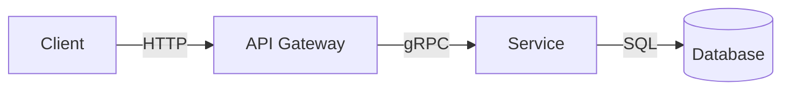

# RFC

Tight, decision-oriented RFCs optimized for review speed. Lead with problem and constraints, focus on behavior and tradeoffs, push deep detail into appendix.

## Output Structure

1. **Header** — Title, Author, Date, Status (Draft/In Review/Accepted/Superseded)
2. **Motivation** — 2–4 sentences: problem, impact, why now. No padding.
3. **Non-Negotiables** — Hard constraints as bullets (SLO, scale, latency, security, compatibility)
4. **Architecture** — Lead with Mermaid `flowchart LR` diagram if >3 components. Follow with prose on data flow, responsibilities, boundaries.
5. **Key Decisions / Tradeoffs** — Each decision with rationale and rejected alternatives
6. **Risks** — Failure modes + mitigation + owner. Table format if >2 risks.
7. **Rollout / Validation** — Steps, observability, blast radius, rollback procedure
8. **Appendix** (optional) — Alternatives considered (≥2 with rejection rationale), state models, algorithms, open questions with owner and due date

## Style Rules

- Each section scannable in <30 seconds
- Bullets over paragraphs. Active voice. Present tense.
- Assume informed senior/staff engineer reviewers
- No executive summary, abstract, or background that belongs in a wiki
- No filler, hedge stacking, or restating obvious context
- Include only details that affect decisions

## Mermaid Diagrams

- Use `flowchart LR` for architecture (never TD)
- Minimal nodes — only components readers need to reason about
- Label edges with data or signals crossing boundaries
- Use `classDef` styling when >5 nodes



## Completion Markers

```text
✓ RFC_COMPLETE: {title} ({section_count} sections)
✓ DECISIONS: {decision_count} key decisions documented
```
