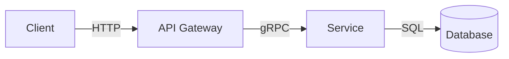

# RFC

Tight, decision-oriented RFCs optimized for review speed. Lead with problem and constraints, focus on behavior and tradeoffs, push deep detail into the appendix.

Two modes:

- **Write**: produce an RFC in the structure below.
- **Review**: grade an existing doc against the same structure with the rubric below. Report findings only; do not rewrite.

For prose tightening use `communication-style`. For an independent second opinion from a different model use `adversary-review`.

## Structure

1. **Header**: Title, Author, Date, Status (Draft / In Review / Accepted / Superseded).
2. **Motivation**: 2–4 sentences. Problem, impact, why now.
3. **Non-Negotiables**: hard constraints as bullets (SLO, scale, latency, security, compatibility). Not preferences.
4. **Architecture**: Mermaid `flowchart LR` first if >3 components, then prose on data flow, responsibilities, boundaries.
5. **Key Decisions / Tradeoffs**: each decision with rationale and at least one rejected alternative (required).
6. **Risks**: failure mode, mitigation, owner. Table if >2 risks.
7. **Rollout / Validation**: steps, observability, blast radius, rollback.
8. **Appendix** (optional): alternatives considered (≥2, each with rejection rationale), state models, algorithms, open questions with owner and due date.

## Style

- Each section scannable in <30 seconds. Bullets over paragraphs, active voice, present tense.
- Assume informed senior/staff reviewers. No executive summary, abstract, or wiki-style background.
- No filler or hedge stacking. Include only details that affect decisions.

## Mermaid

- `flowchart LR` for architecture (not TD). Minimal nodes: only what readers reason about.
- Label edges with the data or signal crossing the boundary. `classDef` styling when >5 nodes.


```mermaid
flowchart LR
    A[Client] -->|HTTP| B[API Gateway]
    B -->|gRPC| C[Service]
    C -->|SQL| D[(Database)]
```

## Review rubric

Locate the doc (ask if it is not in context). Evaluate P0 first; if any P0 fails, report P0s immediately and stop.

**P0: blocks sharing**

- Motivation absent, vague, or longer than 4 sentences.
- Non-Negotiables missing, or stated as preferences.
- Architecture diagram absent when the design has >3 components, or the diagram shows implementation detail instead of component boundaries.
- Key Decisions name no rejected alternative, and the appendix doesn't list ≥2 alternatives considered.

**P1: fix before review**

- Prose contradicts the diagram.
- Risks without mitigation or owner.
- Open questions without owner or due date.
- Padding: abstract, executive summary, or boilerplate.
- Structure deviates from the above without stated reason.

**P2: polish**

- Passive voice or hedge stacking in key claims.
- Empty appendix sections.
- Diagram uses TD instead of LR.

Output one finding per line, then a one-sentence readiness verdict:

```text
[P0|P1|P2] <Section> — <finding> — <recommended fix>
```

Do not invent issues the document does not have.

## Completion markers

```text
✓ RFC_COMPLETE: {title} ({section_count} sections)      # write mode
✓ DECISIONS: {decision_count} key decisions documented   # write mode
✓ RFC_REVIEW: {p0_count} P0, {p1_count} P1, {p2_count} P2 # review mode
```
